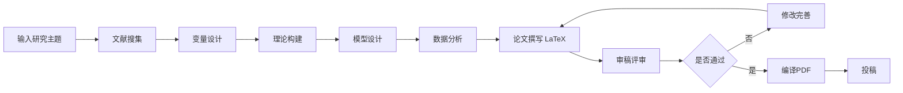

# LaTeX 输出功能使用指南

## 📋 功能概述

ReportWriterAgent 现已支持输出**符合经济学顶刊规范的 LaTeX 格式论文**，可直接编译为 PDF。

### 主要特性

✅ **完整的 LaTeX 文档结构**
- 使用 ctex 宏包支持中文排版
- 包含标题页、摘要、关键词、JEL分类号
- 自动生成目录

✅ **严格的学术规范**
- 三线表（booktabs）格式
- 公式编号与引用（equation环境）
- 规范的文献引用（natbib）
- 符合《经济研究》写作规范

✅ **完整的论文结构**
1. 引言与边际贡献
2. 制度背景与理论假说
3. 研究设计（含因果识别策略）
4. 实证结果与分析
5. 机制分析与异质性讨论
6. 结论与政策启示

✅ **多格式输出**
- `.tex` 文件（可编译为PDF）
- `.md` 文件（便于阅读和修改）
- `.json` 文件（便于数据处理）

---

## 🚀 快速开始

### 方式1：完整研究流程（自然语言输入）

```python
from orchestrator import ResearchOrchestrator

orchestrator = ResearchOrchestrator(output_dir="output/research")

results = orchestrator.run_full_pipeline(
    user_input="我想研究数字化转型对企业创新绩效的影响",
    enable_steps=["input_parse", "literature", "variable", "theory", "model", "analysis", "report"],
    min_papers=10,
    word_count=12000,  # 论文字数要求
)

# 输出文件路径
print(f"LaTeX论文: {results['latex_path']}")
print(f"Markdown备份: {results['report_path']}")
print(f"JSON数据: {results['json_path']}")
```

### 方式2：传统输入方式（指定关键词）

```python
results = orchestrator.run_full_pipeline(
    research_topic="碳交易政策对企业绿色创新的影响研究",
    keyword_group_a=["碳交易", "碳市场", "Carbon Trading"],
    keyword_group_b=["绿色创新", "环境创新", "Green Innovation"],
    min_papers=10,
    word_count=15000,
)
```

### 方式3：单独运行 ReportWriter

```python
result = orchestrator.run_single_step(
    step="report",
    input_data={
        "research_topic": "XX对YY的影响",
        "literature_summary": "...",
        "variable_system": "...",
        "theory_framework": "...",
        "model_design": "...",
        "data_analysis": "...",
        "word_count": 10000,
    }
)
```

---

## 📖 使用示例

### 示例1：生成12000字论文

```bash
# 运行测试脚本
python test_latex_output.py full
```

### 示例2：从命令行运行

```bash
# 使用 run_research.py 脚本
python run_research.py \
    --user-input "我想研究AI技术对劳动力市场的影响" \
    --min-papers 12 \
    --word-count 15000
```

### 示例3：在 Jupyter Notebook 中使用

```python
from orchestrator import ResearchOrchestrator

# 初始化
orchestrator = ResearchOrchestrator()

# 运行研究
results = orchestrator.run_full_pipeline(
    user_input="研究主题",
    min_papers=10,
    word_count=12000
)

# 查看生成的 LaTeX 文件路径
print(results['latex_path'])
```

---

## 🔧 编译 LaTeX 文件

### 方法1：使用 XeLaTeX（推荐）

```bash
cd output/research
xelatex paper_20260122_HHMMSS.tex
xelatex paper_20260122_HHMMSS.tex  # 再次编译以生成正确的交叉引用
```

### 方法2：使用 pdfLaTeX + ctex

```bash
pdflatex -shell-escape paper_20260122_HHMMSS.tex
pdflatex -shell-escape paper_20260122_HHMMSS.tex
```

### 方法3：使用 Overleaf

1. 访问 [Overleaf](https://www.overleaf.com)
2. 上传生成的 `.tex` 文件
3. 点击 "Recompile" 按钮

---

## 📝 LaTeX 文档结构

生成的 `.tex` 文件包含以下部分：

```latex
\documentclass[12pt,a4paper]{article}

% ========== 宏包导入 ==========
\usepackage[UTF8]{ctex}          % 中文支持
\usepackage{geometry}             % 页面设置
\usepackage{amsmath,amssymb}      % 数学公式
\usepackage{booktabs}             % 三线表
\usepackage{graphicx}             % 图片
\usepackage{hyperref}             % 超链接
\usepackage{natbib}               % 文献引用
\usepackage{tikz}                 % 绘制机制路径图

% ========== 文档内容 ==========
\begin{document}

\title{论文标题}
\author{作者信息}
\maketitle

\begin{abstract}
摘要内容...
关键词...
JEL分类号...
\end{abstract}

\tableofcontents

\section{引言}
...

\section{制度背景与理论假说}
...

\section{研究设计}
\subsection{计量模型设定}
\begin{equation}
Y_{it} = \alpha + \beta X_{it} + \gamma Controls_{it} + \mu_i + \lambda_t + \varepsilon_{it}
\label{eq:baseline}
\end{equation}

\subsection{因果识别策略}
...

\section{实证结果与分析}
% 表格示例
\begin{table}[htbp]
\caption{基准回归结果}
\label{tab:baseline}
\begin{tabular}{lcccc}
\toprule
 & (1) & (2) & (3) & (4) \\
\midrule
$X$ & 0.XXX*** & 0.XXX*** & ... \\
\bottomrule
\end{tabular}
\end{table}

\section{机制分析与异质性讨论}
...

\section{结论与政策启示}
...

\begin{thebibliography}{99}
\bibitem{ref1} 作者. 文献标题[J]. 期刊名, 年份.
\end{thebibliography}

\end{document}
```

---

## 🎨 自定义配置

### 调整论文字数

```python
results = orchestrator.run_full_pipeline(
    user_input="研究主题",
    word_count=15000,  # 修改为所需字数
)
```

### 调整文献数量

```python
results = orchestrator.run_full_pipeline(
    user_input="研究主题",
    min_papers=15,  # 增加文献数量
)
```

### 调整模型温度（影响创造性）

修改 `config/config.py` 中的配置：

```python
AGENT_CONFIG = {
    "report_writer": {
        "temperature": 0.7,  # 0.1-1.0，越高越有创造性
    },
}
```

---

## 📊 输出文件说明

### 1. LaTeX 论文 (`.tex`)
- **文件名**: `paper_YYYYMMDD_HHMMSS.tex`
- **用途**: 可直接编译为PDF，符合顶刊投稿格式
- **特点**: 包含完整的LaTeX结构，可在Overleaf或本地编译

### 2. Markdown 备份 (`.md`)
- **文件名**: `report_YYYYMMDD_HHMMSS.md`
- **用途**: 便于快速阅读和修改
- **特点**: 保留所有内容，但格式简化

### 3. JSON 数据 (`.json`)
- **文件名**: `report_YYYYMMDD_HHMMSS.json`
- **用途**: 便于程序化处理和分析
- **特点**: 结构化存储各阶段结果

---

## 🔍 常见问题

### Q1: LaTeX 文件编译报错？

**A:** 可能的原因和解决方案：

1. **中文支持问题**
   ```bash
   # 使用 xelatex 而非 pdflatex
   xelatex paper.tex
   ```

2. **缺少宏包**
   ```bash
   # macOS
   brew install --cask mactex

   # Ubuntu/Debian
   sudo apt-get install texlive-full
   ```

3. **特殊字符问题**
   - 检查是否有未转义的 LaTeX 特殊字符（如 `&`, `%`, `$`, `_`）
   - 在LaTeX中应写为 `\&`, `\%`, `\$`, `\_`

### Q2: 如何修改生成的论文？

**A:** 三种方式：

1. **直接编辑 `.tex` 文件**（推荐）
   - 使用任何文本编辑器打开
   - 修改内容后重新编译

2. **修改 Prompt**
   - 编辑 `prompts/report_writer.py`
   - 添加更具体的要求

3. **在 Overleaf 中编辑**
   - 上传 `.tex` 文件到 Overleaf
   - 在线编辑和编译

### Q3: 如何确保输出符合特定期刊格式？

**A:** 修改 `prompts/report_writer.py` 中的 SYSTEM_PROMPT：

```python
SYSTEM_PROMPT = """
...
你需要参考《经济研究》的最新格式要求：
1. 标题不超过20个汉字
2. 摘要200-300字
3. 关键词3-5个
4. JEL分类号必须包含
5. 参考文献格式：[作者. 文献标题[J]. 期刊名, 年份, 卷(期): 页码.]
...
"""
```

### Q4: 生成的论文质量如何提升？

**A:** 以下建议：

1. **提供更详细的输入**
   - 使用自然语言详细描述研究背景
   - 指定具体的研究方法（如DID、IV等）

2. **增加文献数量**
   ```python
   min_papers=15  # 增加到15篇以上
   ```

3. **使用更强的模型**
   ```python
   # 修改 config/config.py
   DEFAULT_MODEL = "qwen-max"  # 或 gpt-4
   ```

4. **迭代优化**
   - 运行一次后查看结果
   - 根据审稿人意见修改
   - 重新运行特定步骤

---

## 📚 进阶使用

### 使用审稿人功能优化论文

```python
results = orchestrator.run_full_pipeline(
    user_input="研究主题",
    enable_review=True,  # 启用审稿功能
)

# 查看审稿意见
print(results['review_report_data'])

# 根据意见修改后重新生成
# ...
```

### 批量生成多个主题的论文

```python
topics = [
    "数字化转型对企业创新的影响",
    "绿色金融对企业绿色创新的影响",
    "AI技术对劳动力市场的影响"
]

for topic in topics:
    results = orchestrator.run_full_pipeline(
        user_input=topic,
        min_papers=10,
        word_count=12000
    )
    print(f"完成: {topic} -> {results['latex_path']}")
```

### 集成到自动化工作流

```python
import subprocess

# 1. 生成 LaTeX 论文
results = orchestrator.run_full_pipeline(...)

# 2. 自动编译为 PDF
latex_file = results['latex_path']
subprocess.run(['xelatex', latex_file])
subprocess.run(['xelatex', latex_file])  # 二次编译

# 3. 检查 PDF 是否生成成功
pdf_file = latex_file.replace('.tex', '.pdf')
if os.path.exists(pdf_file):
    print(f"PDF 生成成功: {pdf_file}")
```

---

## 🎯 最佳实践

### 1. 论文撰写流程



### 2. 关键质量控制点

✅ **文献阶段**
- 确保文献数量充足（≥10篇）
- 涵盖顶刊文献（AER, QJE, 经济研究等）

✅ **变量设计阶段**
- 确认X、Y变量定义准确
- 中介变量和控制变量完整

✅ **理论假说阶段**
- 理论推演逻辑清晰
- 假设具有可检验性

✅ **模型设计阶段**
- 因果识别策略严谨
- 内生性讨论充分

✅ **论文撰写阶段**
- 叙事结构流畅
- 经济意义解释充分
- LaTeX 格式规范

### 3. 时间规划建议

| 阶段 | 预计时间 | 说明 |
|------|---------|------|
| 输入解析 | 1-2分钟 | 自动提取关键词 |
| 文献搜集 | 5-10分钟 | 取决于min_papers设置 |
| 变量设计 | 3-5分钟 | 设计完整变量体系 |
| 理论构建 | 3-5分钟 | 构建理论框架和假说 |
| 模型设计 | 3-5分钟 | 设计计量模型 |
| 数据分析 | 5-10分钟 | 生成模拟分析结果 |
| 论文撰写 | 10-20分钟 | 生成12000字论文 |
| **总计** | **30-60分钟** | 完整流程 |

---

## 🆘 技术支持

### 查看日志

```python
from loguru import logger

# 日志会自动保存到 logs/ 目录
logger.add("logs/research_{time}.log", rotation="1 day")
```

### 调试模式

```python
# 设置更详细的日志级别
logger.remove()
logger.add(sys.stderr, level="DEBUG")
```

### 报告问题

如遇到问题，请提供：
1. 使用的命令或代码
2. 错误信息（完整的 traceback）
3. 生成的文件路径
4. 配置信息（`config/config.py`）

---

## 📄 许可证

MIT License

---

**更新日期**: 2026-01-22
**版本**: v2.0
**作者**: Multi-Agent Research System Team
